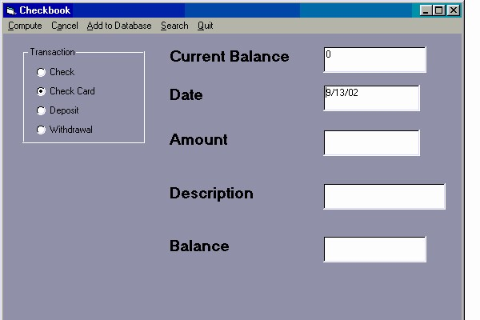



## CheckbookBalancer

### Description

I have been working on this program for quite some time. I am constantly adding to it. This is a great way to keep your checkbook balanced. It keeps all entries in a database with searchable forms. Comments are greatly appreciated.
 
### More Info
 

             |
---                |---
**Submitted On**   |2002-09-13 00:20:24
**By**             |[Richard Rose](https://github.com/Planet-Source-Code/PSCIndex/blob/master/ByAuthor/richard-rose.md)
**Level**          |Beginner
**User Rating**    |4.3 (13 globes from 3 users)
**Compatibility**  |VB 6\.0
**Category**       |[Complete Applications](https://github.com/Planet-Source-Code/PSCIndex/blob/master/ByCategory/complete-applications__1-27.md)
**World**          |[Visual Basic](https://github.com/Planet-Source-Code/PSCIndex/blob/master/ByWorld/visual-basic.md)
**Archive File**   |[CheckbookB1305199132002\.zip](https://github.com/Planet-Source-Code/richard-rose-checkbookbalancer__1-38950/archive/master.zip)

